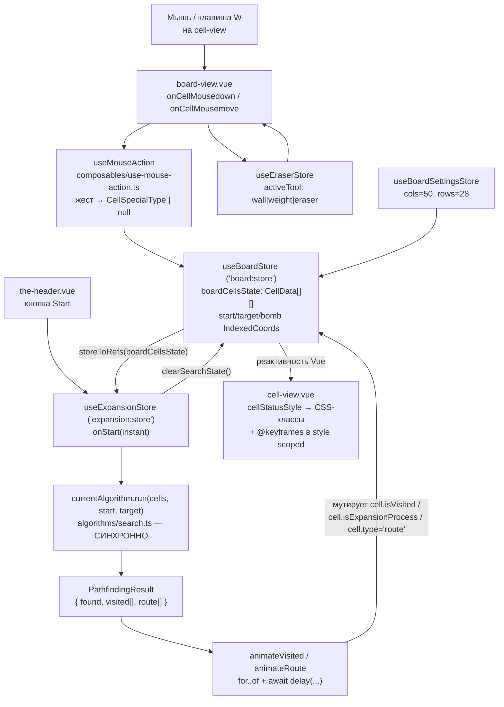

# Архитектура проекта

Визуализатор алгоритмов поиска пути на сетке. SPA без бэкенда: всё состояние живёт в Pinia, всё вычисление — синхронное в браузере, вся «медленность» — намеренная анимация.

## Слои

```
src/
├── main.ts                  # bootstrap: pinia → router → i18n → mount('#app')
├── App.vue                  # только <RouterView />
├── assets/
│   ├── icon/{start,target}.svg
│   └── styles/tailwind.css  # @import 'tailwindcss' + @theme (дизайн-токены)
├── core/                    # оболочка приложения: не знает про доску
│   ├── components/
│   │   ├── the-header.vue   # вся панель управления
│   │   └── ui/{ui-button,ui-select,ui-svg}.vue
│   ├── i18n/{index.ts,locales/{ru,en}.ts}
│   ├── lib/{utils.ts,is-equal.ts}
│   ├── router/index.ts
│   └── views/home-view.vue  # layout: <the-header /> + <board-view />
└── modules/
    └── board/               # фича целиком
        ├── algorithms/      # чистые вычисления
        ├── components/{board-view,cell-view}.vue
        ├── composables/{use-mouse-action,use-eraser-mode}.ts
        ├── constants.ts
        ├── index.ts         # публичный API модуля (barrel)
        ├── stores/          # 4 Pinia-стора
        ├── types/
        └── utils/{delay,generate-default-board,maze-generators}.ts
```

`src/modules/board/services/` — пустая директория-артефакт. Файлов `*.service.ts` в проекте нет; не воспринимать её как живую конвенцию.

## Граница core ↔ modules

- `core/` содержит оболочку: `App.vue` (`src/App.vue:1-3` — ровно три строки, только `<RouterView />`), роутер, i18n, UI-примитивы и layout-вью.
- `modules/board/` содержит домен. Импорт идёт **в одну сторону**: `core/views/home-view.vue:2` импортирует `BoardView` из `@/modules/board`, а модуль доски не импортирует ничего из `core/views` или `core/router`. Единственная зависимость модуля от core — UI-примитив: `src/modules/board/components/cell-view.vue:5` тянет `@/core/components/ui/ui-svg.vue`.
- Панель управления `src/core/components/the-header.vue` лежит в `core/`, но это самый связанный с доменом файл: он импортирует четыре стора, реестр алгоритмов и типы паттернов из `@/modules/board` (`the-header.vue:5-15`, `:21`).

## Контракт barrel-экспортов

`src/modules/board/index.ts` — единственная точка входа модуля для внешних потребителей.

- Только явные именованные реэкспорты, `export *` не используется нигде.
- Типы — через `export type { ... } from` (`src/modules/board/index.ts:6-8`, `src/modules/board/types/index.ts:1-2`, `src/modules/board/algorithms/index.ts:1`).
- SFC реэкспортируется через переименование default: `export { default as BoardView } from './components/board-view.vue'` (`src/modules/board/index.ts:21`). Это единственный компонент в barrel — `cell-view.vue` внутренний и импортируется относительным путём (`board-view.vue:3`).
- Barrel вложен: `algorithms/index.ts` реэкспортирует из `algorithms/search.ts`, а `index.ts` модуля реэкспортирует из `algorithms/index.ts`.

### Известные дыры контракта

- `VisualizationSpeed` и `BoardTool` **не** реэкспортируются из barrel, поэтому `the-header.vue:22-23` импортирует их глубокими путями `@/modules/board/stores/use-expansion-store` и `.../use-eraser-store`. Если добавляете тип в стор и он нужен снаружи — добавьте его в `src/modules/board/index.ts`, иначе появится ещё один глубокий импорт.
- `board-view.vue` импортирует сам себя через собственный barrel (`board-view.vue:4`, `:7`, `:8` — `@/modules/board`) и одновременно относительными путями (`:6`, `:9`). Правило: внешние потребители — через barrel, внутримодульный код — относительными путями; `board-view.vue` его нарушает.
- `src/modules/board/types/graph.types.ts` (`GraphRouteData`, `GraphTreeData`) реэкспортируется по всей цепочке, но ни один алгоритм и ни один стор его не использует — `search.ts` работает на плоских массивах `previous: Array<number | null>`.

## Алиас и роутинг

- Все внутренние импорты идут через `@/...`. Алиас объявлен дважды и должен держаться синхронно: `vite.config.ts` (`resolve.alias` → `fileURLToPath(new URL("./src", import.meta.url))`) и `paths: { "@/*": ["./src/*"] }` в **обоих** `tsconfig.app.json` и `tsconfig.json`. Относительные пути остались только в `src/main.ts:3,7`, `src/core/i18n/index.ts:2-3` и внутри модуля доски.
- Роутинг локале-префиксный. Единственный реальный маршрут — `` path: `/:locale(${localePattern})` `` с `name: 'home'` (`src/core/router/index.ts:11-13`), где `localePattern = SUPPORTED_LOCALES.join('|')` → `ru|en` (`:5`). `/` и catch-all `/:pathMatch(.*)*` редиректят на `/${DEFAULT_LOCALE}` = `/ru` (`:15-22`).
- `router.beforeEach` (`src/core/router/index.ts:26-32`) — гард только с побочным эффектом: валидирует `to.params.locale`, ставит `i18n.global.locale.value` и `document.documentElement.lang`. Ничего не возвращает, редиректов не делает.
- Переключение языка идёт **через роутер**, а не мутацией i18n: writable computed в `the-header.vue:76-79` имеет `set: value => router.push(`/${value}`)`.

## Поток данных: ввод → стор → алгоритм → анимация



Пошагово:

1. **Ввод.** `cell-view` — «глупый» компонент: он не эмитит ничего (`defineEmits` в проекте не встречается ни разу), родитель вешает нативные `@mousedown` / `@mousemove` и оборачивает payload в стрелку — `board-view.vue:88-89`.
2. **Интерпретация жеста.** `useMouseAction` (`use-mouse-action.ts:5`) держит флаги перетаскивания start/target/bomb, слушает клавишу `w` для режима веса и глобальные `mouseup`/`mouseleave` через `useEventListener` из VueUse (`:41-48`). `getMovedCellType()` возвращает, какую спец-ячейку сейчас тащат.
3. **Мутация состояния.** `board-view.vue:35-48` решает `wall` или `weight` и вызывает `boardStore.setCellSetting(data, currentType, drawMode)` либо `boardStore.eraseCell(data)`. Все инварианты (нельзя затирать start/target/bomb) живут в сторе, а не на месте вызова — каждый мутатор начинается с `isProtectedCell` (`use-board-store.ts:81`, `:89`, `:148`, `:154`).
4. **Вычисление.** `useExpansionStore.onStart()` строит список чекпоинтов (`use-expansion-store.ts:74-77`) и на каждом зовёт `runSegment`, который синхронно вызывает `currentAlgorithm.value.run(...)` (`:62`). Алгоритм **не** трогает стор и **не** анимирует — он возвращает `PathfindingResult`.
5. **Анимация.** `animateVisited` (`:42-50`) и `animateRoute` (`:52-59`) идут `for...of` по результату, мутируют по одной ячейке и делают `await delay(...)`. Между await'ами Vue успевает перерисовать — **последовательный await и есть анимация**. Батчинг мутаций или `Promise.all` её уничтожат.
6. **Рендер.** `cell-view.vue:30-43` собирает класс из заранее объявленных `Record`-таблиц; сама анимация — `@keyframes` в `<style scoped>` (`:91-150`), использующие CSS-переменные из `@theme`.

### Ветвление потока: бомба и мгновенный перезапуск

- **Бомба как waypoint.** Если бомба стоит и `currentAlgorithm.supportsBomb`, поиск идёт двумя последовательными сегментами start→bomb, bomb→target (`use-expansion-store.ts:74-87`). Если любой сегмент вернул `found: false`, прогон обрывается и `isExpansionFinished` остаётся `false`.
- **Перетаскивание после завершения.** `watch` на `[startCellCoords.index, targetCellCoords.index, bombCellCoords?.index ?? -1]` (`use-expansion-store.ts:93-99`) вызывает `void onStart(true)` — тот же путь, но флаг `instant` пропускает все `delay`, поэтому маршрут пересчитывается «мгновенно» при перетаскивании точки.
- **Инварианты при смене алгоритма.** `setAlgorithm` (`:28-36`) снимает бомбу, если `!supportsBomb`, обнуляет веса, если `!weighted`, и чистит результат прошлого поиска.

## Реестр сторов

| Стор | id | Файл | Ответственность |
|---|---|---|---|
| `useBoardStore` | `board:store` | `stores/use-board-store.ts:15` | сетка `CellData[][]`, координаты start/target/bomb, все мутации ячеек, лабиринты, reset |
| `useBoardSettingsStore` | `board-settings:store` | `stores/use-board-settings-store.ts:9` | `cols`/`rows` (только два ref, без клампа) |
| `useExpansionStore` | `expansion:store` | `stores/use-expansion-store.ts:19` | выбранный алгоритм, скорость, оркестрация прогона и анимации |
| `useEraserStore` | `eraser:store` | `stores/use-eraser-store.ts:6` | `activeTool: 'wall' \| 'weight' \| 'eraser'` (id исторический — покрывает все три инструмента) |

Composition между сторами — вызов чужого `use*`-хука прямо в setup-теле: `use-board-store.ts:16` зовёт `useBoardSettingsStore()`, `use-expansion-store.ts:20-21` — `useBoardStore()` + `storeToRefs`.
